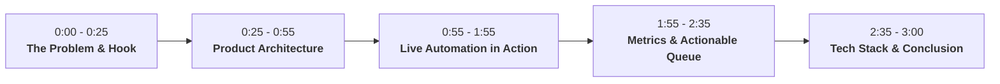

# Product Showcase Video Script: Autonomous Daily Job Application Pipeline

**Target Duration:** 2:30 – 3:00 minutes  
**Target Platforms:** YouTube Demo, LinkedIn Showcase, Product Hunt, Twitter / X Launch  
**Tone:** Confident, engineering-focused, product-ready, and energetic.

---

## Executive Overview

```
                                      DAILY MORNING RUN
                                 (python daily_pipeline.py)
                                              │
                    ┌─────────────────────────┴─────────────────────────┐
                    ▼                                                   ▼
       applications_log.csv                                    external_jobs.csv
    (Permanent Application History)                       (Today's Working Manual Queue)
    • Never reset across days                             • Reset to 0 rows at start of every run
    • Stores all successful submissions                   • Incrementally populated during run
    • Blocks reapplying to same jobs                      • ONLY external ATS/careers links
    • Tracks historical counts                            • No duplicates / No applied jobs
```

---

## 🎬 Scene-by-Scene Breakdown



---

### Scene 1: The Problem & The Hook (0:00 – 0:25)

| Timestamp | Visual / Screen Recording Action | Voiceover Audio Script | On-Screen Overlay Text |
| :--- | :--- | :--- | :--- |
| **0:00 – 0:08** | Fast montage of clicking through 5 browser tabs (Naukri, LinkedIn, Hirist, Instahyre) with repetitive dropdowns, modals, and questionnaires. | *"Applying to tech jobs today feels like a full-time job in itself. You spend two to three hours every single morning manually searching across five different platforms, filling out the exact same screening questions again and again."* | **The Job Hunt Bottleneck**<br>❌ 5 Portals<br>❌ Repetitive Forms<br>❌ 3+ Hours Daily |
| **0:08 – 0:25** | Cut to terminal running `python daily_pipeline.py`. The startup banner with clean styling appears. | *"What if you could turn that entire morning grind into a single automated pipeline? Today, I’m showcasing an autonomous, AI-powered multi-platform job application engine that searches, matches, answers screening questions, and applies for you while you sip your morning coffee."* | **Introducing the Autonomous Daily Job Pipeline**<br>🚀 1 Command. 5 Platforms. |

---

### Scene 2: Product Architecture & 5-in-1 Coverage (0:25 – 0:55)

| Timestamp | Visual / Screen Recording Action | Voiceover Audio Script | On-Screen Overlay Text |
| :--- | :--- | :--- | :--- |
| **0:25 – 0:40** | Split screen / animated graphic displaying the 5 supported platforms: **Naukri**, **LinkedIn**, **Hirist**, **Uplers**, and **Instahyre**. | *"The system is built as a daily pipeline supporting five major platforms: Naukri, LinkedIn Easy Apply, Hirist.tech, Uplers Talent, and Instahyre."* | **5-in-1 Unified Engine**<br>• Naukri.com<br>• LinkedIn Easy Apply<br>• Hirist.tech<br>• Uplers<br>• Instahyre |
| **0:40 – 0:55** | Visual graphic illustrating **Permanent Application History** vs. **Today's Working CSV**. | *"Unlike naive scrapers, it uses an isolated two-tier database. It permanently remembers every successful application to guarantee zero duplicate submissions, and generates a fresh, clean working queue of external company ATS links every single morning."* | **Zero Duplicate Guarantee**<br>🔒 Permanent History Log<br>📋 Fresh Daily Working Queue |

---

### Scene 3: Live Automation & AI Screening Engine (0:55 – 1:55)

| Timestamp | Visual / Screen Recording Action | Voiceover Audio Script | On-Screen Overlay Text |
| :--- | :--- | :--- | :--- |
| **0:55 – 1:15** | Browser window opens: Playwright navigates to Hirist & Instahyre `/screening`, fills text inputs and selects radio buttons automatically. | *"Here's the engine in action. On Hirist and Instahyre, the bot scans fresh listings matching the candidate's exact experience bracket. When it encounters screening questionnaires, it doesn't break."* | **Smart Screening Automation**<br>✅ Experience Matching<br>✅ Dynamic Form Filling |
| **1:15 – 1:35** | Terminal shows Groq AI (`Qwen-2.5-32B`) drafting responses. Naukri chatbot drawer is answered in real-time. | *"Using Groq's low-latency LLM engine integrated with structured candidate profile facts, it dynamically drafts contextual answers for technical questions, role requirements, and availability—submitting applications in seconds."* | **LLM-Powered Reasoning**<br>⚡ Groq API + Qwen LLM<br>🛡️ Zero Hallucinations |
| **1:35 – 1:55** | LinkedIn multi-step Easy Apply dialog steps through Contact ➔ Questions ➔ Review ➔ Submit. | *"On LinkedIn, it handles multi-step Easy Apply dialogs, fills required dropdowns, reviews the submission, and verifies confirmation before logging the success."* | **Multi-Step Flow Verification**<br>✓ Contact Info<br>✓ Custom Questions<br>✓ Confirmed Submission |

---

### Scene 4: Daily Summary Dashboard & Clean External Queue (1:55 – 2:35)

| Timestamp | Visual / Screen Recording Action | Voiceover Audio Script | On-Screen Overlay Text |
| :--- | :--- | :--- | :--- |
| **1:55 – 2:15** | Terminal prints the complete **Daily Job Application Summary** with live numbers: 1,495 fresh jobs discovered, 61 applied today, 106 historical, 513 external jobs. | *"At the end of the morning run, you get a clean executive summary: fresh jobs discovered, previously applied jobs skipped, and exact application breakdowns per platform."* | **Executive Daily Summary**<br>📊 1,495 Discovered<br>🎯 61 Applied Today<br>📈 106 Historical Total |
| **2:15 – 2:35** | Open `external_jobs.csv` in VS Code or Excel. Highlight columns: `Company`, `Role`, `Skills`, `Careers Link`, `Match Reason`. | *"For companies that require external ATS submissions on Greenhouse, Lever, or Workday, the pipeline curates an actionable CSV with direct careers links, matching skills, and relevance analysis. No junk, no duplicates—just high-match opportunities ready for manual submission."* | **Actionable External Queue**<br>🎯 Greenhouse / Lever / Workday<br>💡 Skill Matching & Relevance Score |

---

### Scene 5: Tech Stack & Call to Action (2:35 – 3:00)

| Timestamp | Visual / Screen Recording Action | Voiceover Audio Script | On-Screen Overlay Text |
| :--- | :--- | :--- | :--- |
| **2:35 – 2:50** | Quick showcase of code structure: `Python`, `Playwright`, `Groq API`, `async event handling`. | *"Built entirely with Python, Playwright for resilient browser automation, and Groq LLMs for real-time intelligence. It respects rate limits, uses randomized human-like delays, and keeps private keys secure."* | **Tech Stack**<br>🐍 Python 3.10+<br>🎭 Playwright<br>⚡ Groq Cloud AI |
| **2:50 – 3:00** | End card with your GitHub repository link and contact / demo handles. | *"This is how we automate the job hunt in 2026. Check out the link in the description for the full source code and setup guide. Thanks for watching!"* | **Star on GitHub ⭐**<br>`github.com/ganesh-pkl/jobs-automation` |

---

## 🎥 Recording & Editing Guidelines

1. **Terminal Capture:**
   * Use dark themes (Catppuccin, Tokyo Night, or Dracula).
   * Increase font size to 16–18pt for crisp readability on mobile devices.
2. **Speeding Up Waiting Times:**
   * During randomized human delays (`Waiting 90s before next application...`), speed up the video footage by **4x–8x** with a subtle clock or fast-forward icon.
3. **Audio & Pacing:**
   * Keep voice clear and enthusiastic.
   * Add light, ambient lo-fi background music at 10–15% volume.

---

## 📱 Social Media Copy Template (LinkedIn / Twitter / Product Hunt)

```text
🚀 I built an autonomous daily job application pipeline across 5 platforms (Naukri, LinkedIn, Hirist, Uplers, Instahyre).

Instead of manually spending 3 hours every morning searching and answering the same screening questionnaires, this Python + Playwright + Groq AI engine does it in one single morning run:

🔹 5-in-1 Platform Engine: Unified execution across 5 top portals.
🔹 LLM Screening Answering: Automatically fills screening questions using verified candidate facts + Qwen LLM.
🔹 Zero Duplication: Persistent database remembers past submissions to guarantee you never re-apply to the same role.
🔹 Actionable External Queue: Detects external ATS links (Greenhouse, Lever) and generates a daily curated CSV with skill-match breakdowns.

In today's test run:
⚡ 1,495 fresh postings scanned
🎯 61 successful platform applications submitted
📋 513 high-match external opportunities curated

Check out the full demo video and GitHub repo below! 👇

#Python #Playwright #AI #Automation #WebScraping #JobSearch #OpenSource #Groq
```
